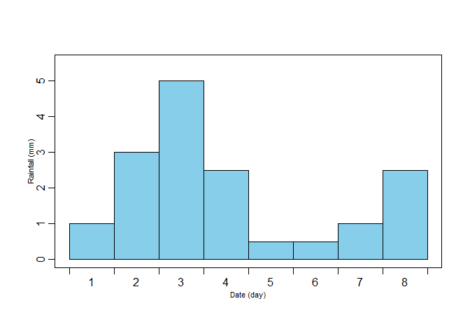
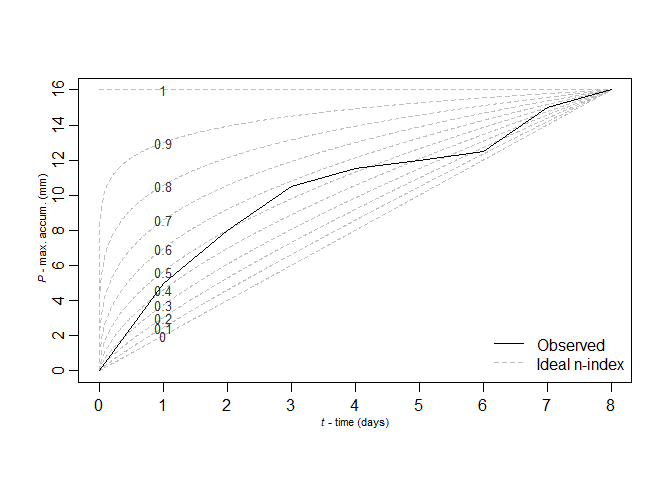
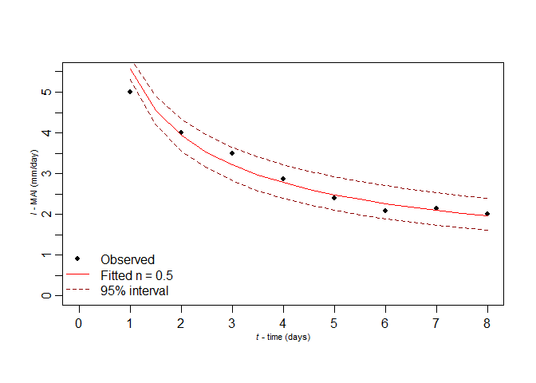
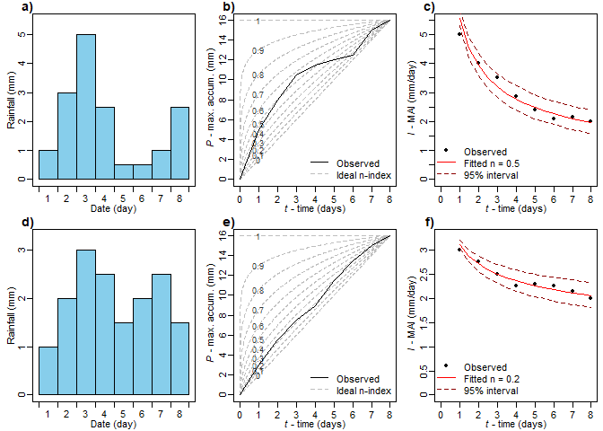
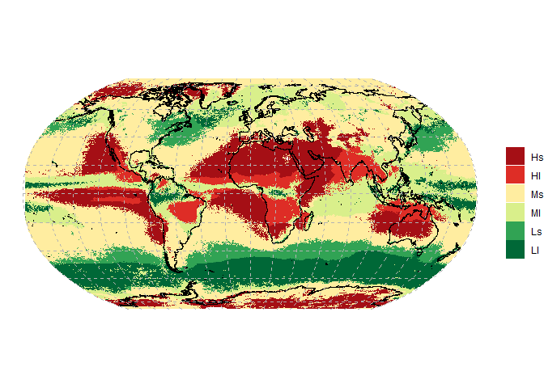

Climatic classification of drought typologies
================
Robert Monjo, Dominic Royé, Javier Martin-Vide
19 juny de 2019

Abstract
--------

Drought duration strongly depends on the definition thereof. In meteorology, dryness is habitually measured by means of fixed thresholds (e.g. 0.1 or 1 mm usually define dry spells) or climatic mean values (as is the case of the Standardised Precipitation Index), but this also depends on the aggregation time interval considered. However, robust measurements of drought duration are required for analysing the statistical significance of possible changes. Herein we have climatically classified the drought duration around the world according to their similarity to the voids of the Cantor set. Dryness time structure can be concisely measured by the n-index (from the regular/irregular alternation of dry/wet spells), which is closely related to the Gini index and to a Cantor-based exponent. This enables the world's climates to be classified into six large types based upon a new measure of drought duration. We performed the dry-spell analysis using the full global gridded daily Multi-Source Weighted-Ensemble Precipitation (MSWEP) dataset. The MSWEP combines gauge-, satellite-, and reanalysis-based data to provide reliable precipitation estimates. The study period comprises the years 1979-2016 (total of 45165 days), and a spatial resolution of 0.5º, with a total of 259,197 grid points.

Example of n-index applied to wet spells
----------------------------------------

The n-index (between 0 and 1) was designed to measure the regularity of consecutive values of rainfall within an event. It is estimated from the exponent of the power law relating the maximum averaged intensity over given periods of time (e.g. minutes, hours or days) and these periods of averaging.

### Loading functions

``` r
source("n-index.r")
source("functions_spell.R")
```

### Background

Let p1 and p2 be two wet spells at daily scale, such as the first one is relatively more concentrated (n = 0.5) than the second one (n = 0.2)

``` r
p1 = c(1,3,5,2.5,0.5,0.5,1,2.5)
p2 = c(1,2,3,2.5,1.5,2,2.5,1.5)
```

Then, it is possible to compare the hyetographs (left panel), the maximum accumulated precipitation (central panel) Example of n-index estimation for 2 rainfall events from 8 individual reports: hyetographs (left panel); maximum precipitation P for the integration time t (central panel); maximum average intensities (MAI) Iand fitted curves for each case (right panel), according to the ecuation I = Imax(tmax/t)^n. Theoretical curves (dashed lines) for maximum precipitation (central panel) are built from the equation P = Pmax(t/tmax)^(1−n)

``` r
plot_n(p1)
```



    ## 
    ##  Two-sample Kolmogorov-Smirnov test
    ## 
    ## data:  pp/1:T and py
    ## D = 0.125, p-value = 1
    ## alternative hypothesis: two-sided

``` r
par(mfrow=c(2,3),oma=c(0,0,0,0), mar = c(2.6,2.9,1.2,0.5))
plot_n(p1,noms=c("a)","b)","c)"),cex=1.04)
```

    ## 
    ##  Two-sample Kolmogorov-Smirnov test
    ## 
    ## data:  pp/1:T and py
    ## D = 0.125, p-value = 1
    ## alternative hypothesis: two-sided

``` r
plot_n(p2,noms=c("d)","e)","f)"),cex=1.04)
```



    ## 
    ##  Two-sample Kolmogorov-Smirnov test
    ## 
    ## data:  pp/1:T and py
    ## D = 0.125, p-value = 1
    ## alternative hypothesis: two-sided

### Load data example

The n-index method can be applied to both amounts both dry and wet spells. Three different points will be used for this example from the Multi-Source Weighted-Ensemble Precipitation ([MSWEP](http://www.gloh2o.org/)) dataset on which is based the study.

``` r
load("test_points.RData")
str(test_points)
```

    ## List of 2
    ##  $ pr    :'data.frame':  13880 obs. of  4 variables:
    ##   ..$ date      : Date[1:13880], format: "1979-01-01" ...
    ##   ..$ p1_africa : num [1:13880] 5.65 2.32 7.87 37.91 1.51 ...
    ##   ..$ p2_atacama: num [1:13880] 0 0 0 0 0 ...
    ##   ..$ p3_india  : num [1:13880] 0 0 0 0 0 0 0 0 0 0 ...
    ##  $ lonlat:'data.frame':  3 obs. of  3 variables:
    ##   ..$ lat: num [1:3(1d)] 1.75 -22.75 20.75
    ##   ..$ lon: num [1:3(1d)] 24.2 -69.2 80.2
    ##   ..$ p  : Factor w/ 3 levels "p1","p2","p3": 1 2 3

``` r
#coordinates of sample points
test_points$lonlat
```

    ##      lat    lon  p
    ## 1   1.75  24.25 p1
    ## 2 -22.75 -69.25 p2
    ## 3  20.75  80.25 p3

``` r
pr <- test_points$pr

#mean dry/wet days
apply(pr[, 2:4], 2, mean_dw_days)
```

    ## $p1_africa
    ## $p1_africa$wet
    ## [1] 257.1842
    ## 
    ## $p1_africa$dry
    ## [1] 108.0789
    ## 
    ## 
    ## $p2_atacama
    ## $p2_atacama$wet
    ## [1] 2.210526
    ## 
    ## $p2_atacama$dry
    ## [1] 363.0526
    ## 
    ## 
    ## $p3_india
    ## $p3_india$wet
    ## [1] 126.8421
    ## 
    ## $p3_india$dry
    ## [1] 238.4211

``` r
#mean dry/wet spell
apply(pr[, 2:4], 2, mean_spells)
```

    ## $p1_africa
    ## $p1_africa$wet
    ## [1] 4.501612
    ## 
    ## $p1_africa$dry
    ## [1] 1.891755
    ## 
    ## 
    ## $p2_atacama
    ## $p2_atacama$wet
    ## [1] 1.333333
    ## 
    ## $p2_atacama$dry
    ## [1] 215.5625
    ## 
    ## 
    ## $p3_india
    ## $p3_india$wet
    ## [1] 5.12221
    ## 
    ## $p3_india$dry
    ## [1] 9.617834

``` r
#n-index: n and I0
apply(pr[, 2:4], 2, nindex_spell)
```

    ## $p1_africa
    ## $p1_africa$I0
    ## [1] 7.452648
    ## 
    ## $p1_africa$n
    ## [1] 0.3239289
    ## 
    ## 
    ## $p2_atacama
    ## $p2_atacama$I0
    ## [1] 284.0345
    ## 
    ## $p2_atacama$n
    ## [1] 0.4541468
    ## 
    ## 
    ## $p3_india
    ## $p3_india$I0
    ## [1] 33.42805
    ## 
    ## $p3_india$n
    ## [1] 0.5093033

The clasification of drought uses the n-index and the wet spells: Low (L), medium (M) or high (H) values of the DSS -index: Type S when *n* &lt; 0.3, Type M if *n* is within the interval (0.3, 0.4), and Type L for *n* &gt; 0.4. For the three main types, it is advisable to distinguish between the alternation with longer (ℓ) or shorter (s) wet events.

Map of drought typologies
-------------------------

### Required packages

``` r
library(tidyverse)
library(sf)
library(raster)
library(rnaturalearth)
```

### Preparing data

1.  Import the raster and the legend classes.
2.  Project the raster from WGS84 to Robinson.
3.  Joining the id classes to the drought clasification.
4.  Mapping the final data with ggplot2

``` r
#raster data
drought_raster <- raster("./data/drought_class.tif")

#projection 
crs_robin <- "+proj=robin +lon_0=0 +x_0=0 +y_0=0 +ellps=WGS84 +datum=WGS84 +units=m +no_defs"

#project
drought_raster <- projectRaster(drought_raster, 
                                crs = crs_robin,
                                method = "ngb",
                                over = TRUE)

#raster to xyz
drought_df <- rasterToPoints(drought_raster) %>%
                      as.data.frame() %>% 
                         mutate(id = as.character(drought_class)) %>%
                           dplyr::select(-drought_class)

#legend
drought_legend <- read_csv("./data/legend_drought_class.csv") %>%
                        mutate(id = as.character(id))


#join xyz with legend classes 
drought_df <- left_join(drought_df, drought_legend,  by = "id") 

#drought class to factor 
lab <- unique(drought_df$class)

drought_df <- mutate(drought_df, class = factor(class, lab[c(2,6, 1,3, 4:5)]))
```

### Mapping

``` r
#world coastline
world <- ne_coastline(scale = 10, returnclass = "sf") %>% 
              st_transform(crs = crs_robin)

#breaks and labels for long/lat
brk_x <- c(-180,-130,-80,-30,0,30,80,130,179)
brk_y <- c(-90,-65,-40,-15,0,15,40,65,90)

lab_x <- case_when(brk_x<0 ~ str_c(abs(brk_x),"ºW"),
                   brk_x==0 ~ "0º",
                   brk_x>0 ~ str_c(brk_x,"ºE"))

lab_y <- case_when(brk_y<0 ~ str_c(abs(brk_y),"ºS"),
                   brk_y==0 ~ "0º",
                   brk_y>0 ~ str_c(brk_y,"ºN"))


#colours for legend
col <- c("#a50f15","#de2d26","#ffeda0","#d9ef8b","#31a354","#006837")


#graticules 
grat_map <- st_graticule() %>% 
             st_transform(crs_robin) %>% 
               st_geometry 


#map with ggplot2
ggplot(drought_df)+
  geom_tile(aes(x, y, fill = class))+
  geom_sf(data = world, 
          size = 0.3, 
          colour = "black")+
  geom_sf(data = grat_map,
          linetype = "dashed",
          colour = "grey70",
          alpha = 0.3, size = 0.15)+
  scale_fill_manual(values = col)+
     coord_sf()+
      theme_void()+
       labs(fill = "")
```



Other related global maps (mean dry/wet spell, n-index, etc) are available at [10.5281/zenodo.3247041](10.5281/zenodo.3247041).

How to cite
-----------

Data: Monjo, R; Royé, D; Martin-Vide, J. (2019). Drought lacunarity around the world and its classification. doi: [10.5281/zenodo.3247041](10.5281/zenodo.3247041)

Methodology of n-index: 1) Monjo, R. (2016): Measure of rainfall time structure using the dimensionless n-index, Clim. Res., 67, 71–86. [10.3354/cr01359](https://doi.org/10.3354/cr01359) 2) Monjo, R. and Martin-Vide, J. (2016): Daily precipitation concentration around the world according to several indices, Int. J. Climatol., 36, 3828–3838. [10.1002/joc.4596](https://doi.org/10.1002/joc.4596)
